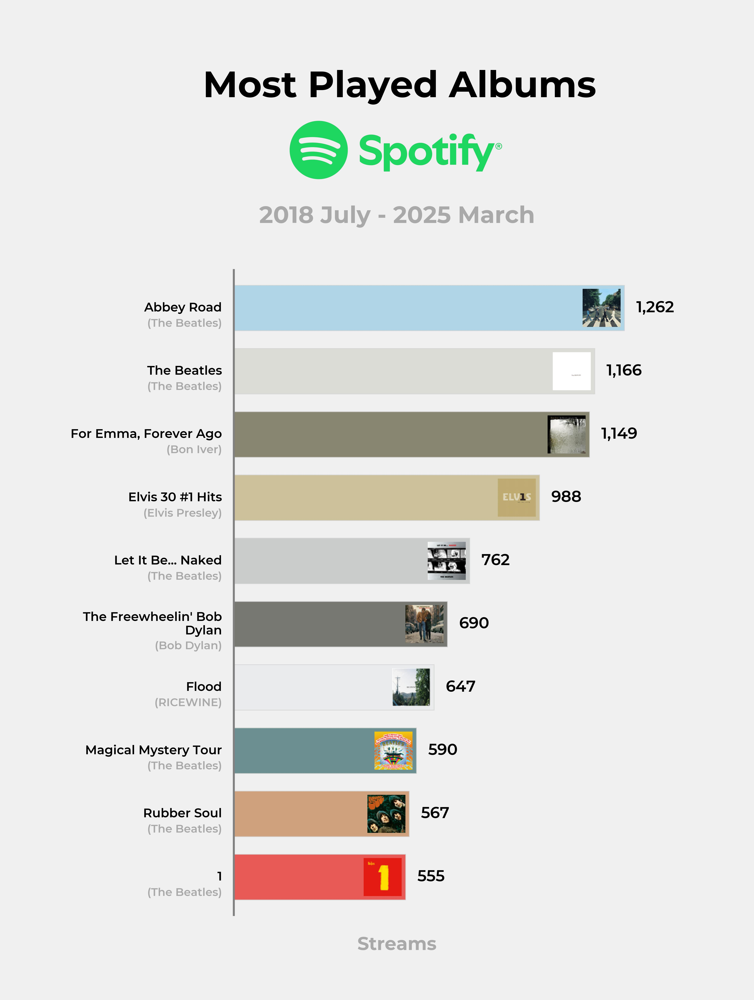

# Viztrack Studio App
👋 Welcome to the Viztrack Studio App! This web app allows you to visualize your Spotify data in a fun and interactive way.

The user has the ability to select how many items they want to visualize, and whether it's artists, songs, or albums. The app generates both static images and animations! 🎵🎵

Top 5 Artists you've ever listened to? Top 10 Songs? Top 3 Albums you've listened to the most this decade? The app can visualize all of this data and allow you to share it with your friends in a social media friendly format! 

The web app is deployed on Streamlit Cloud and you can access it [here](https://maxwell-bernard-spotify-animation-app.streamlit.app/).

# Example Visualizations

    
    

## Features
- **Animations**: Generate animations that showcase your favorite artists, songs, or albums.
- **User-Friendly Interface**: Easy to use with a clean and modern design.
- **Shareable**: Download your Visualisations and animations to share on social media or with friends.
- **Open Source**: Built with Python and Streamlit, the code is available for anyone to contribute or modify.
- **Third-Party Tool**: Uses Spotify data but is not affiliated with or endorsed by Spotify.
- **Privacy Focused**: Your Spotify data is processed locally, and no personal information is stored or shared.
- **Feedback Mechanism**: Users can provide feedback and suggestions for new features or improvements.

## Libraries/Tools Used
Python, Streamlit, Polars, Pandas, Matplotlib, NumPy, Requests, FFmpeg, HTML/CSS, colorthief, supabase, Spotipy

## How to use
1. **Upload your Spotify data**: follow the instructions on the web app
2. **Select Data Type**: Choose whether you want to visualize your favorite artists, songs, or albums.
3. **Generate Image and Animation**: Click the buttons to create your Visualisations.
4. **Share**: Download the generated images and animations to share with your friends!

Please share the app with your friends and family, and let them know about this fun way to visualize their Spotify data!

*Disclaimer: Spotify is a registered trademark of Spotify AB. This app is a third-party tool that uses Spotify data and is not affiliated with or endorsed by Spotify*

Created by [Maxwell Bernard](https://github.com/maxwell-bernard)
July 2025
